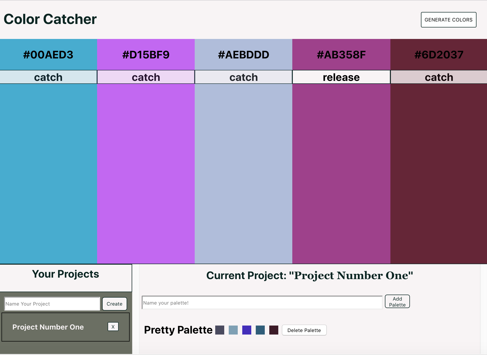

# Color Catcher

## Description

 Color Catcher is a project inspired by the website Coolors. It allows a user to randomly generate colors, create projects, and save a "palette" of colors to a specific project. It is a partner project at Turing that required both a frontend and a backend to be built
 You can view the Back-End Repository [here](https://github.com/lboyer4/color-catcher-backend.git).
 
 Heroku deployment: [Color Catcher Backend](https://colorcatcher.herokuapp.com/)

## Installation
  #### 1. Clone down this repo and cd in to it
  ```git clone https://github.com/lboyer4/color-catcher-frontend.git```
  #### 2. Run npm install
 ```npm install```
  #### 4. Clone down the backend repo and cd in to
  ```git clone https://github.com/lboyer4/color-catcher-backend.git```
  #### 5. Run the server
  ```npm start```
  #### 6. Run the frontend
  ```npm start```

 ## Frontend UI
 
 
 ## Wireframes
 

## Goals
The goals of this project's frontend was to create an App that generates random colors, allows you to "freeze" colors, and save projects and palettes to the backend. It uses ReactJS, Redux, Enzyme, and Jest.

The goals of this project's backend was to get comfortable using Express and Node.js, and to implement Travis CI.

## Contributors
[Lauren Boyer](https://github.com/lboyer4)

[Sally Haefling](https://github.com/SallyHaefling)
